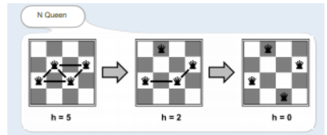
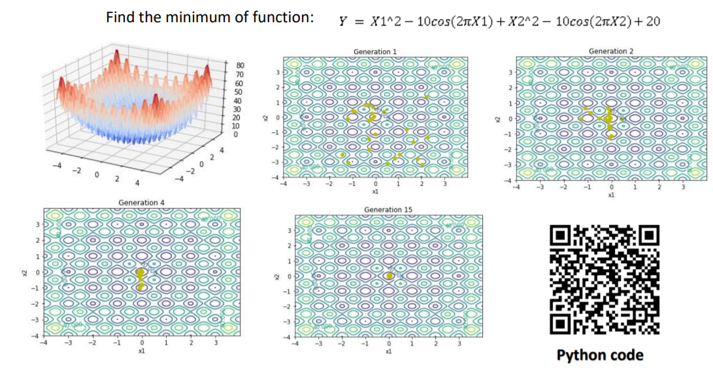
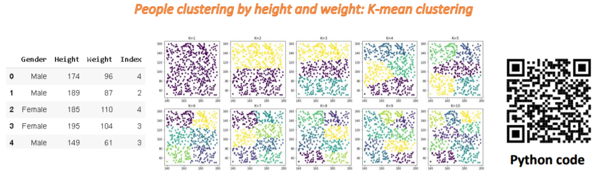
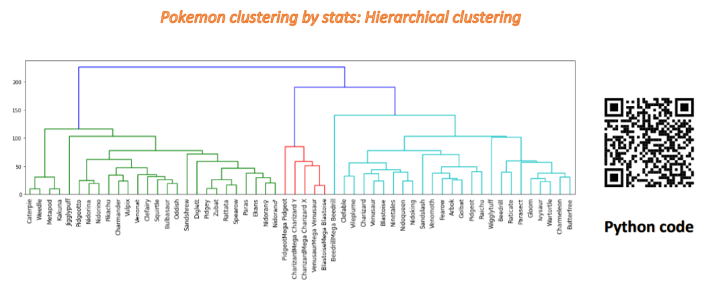
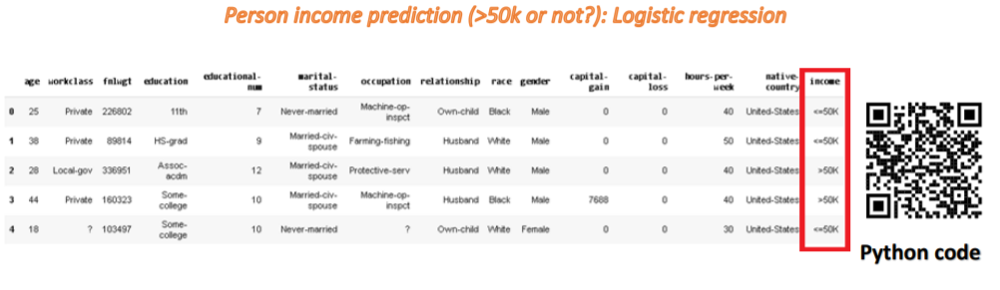

# 2100498 AI-for-Engineer, Chulalongkorn University, 2019

Optimization
1. Hill Climb (find the minimum h in n-Queen problem)

2. Genetic algorithm

  
Machine Learning
1. K-mean clustering

3. H-clustering

5. Linear regression

7. Logistic regression

9. Decision tree
10. Naïve Bayes classifier
  
Deep learning
1. Face mask classification
2. Pneumonia classification
3. MNIST and CIFAR10 classification
  
Note: open in Google Colab to view contents in each notebook
