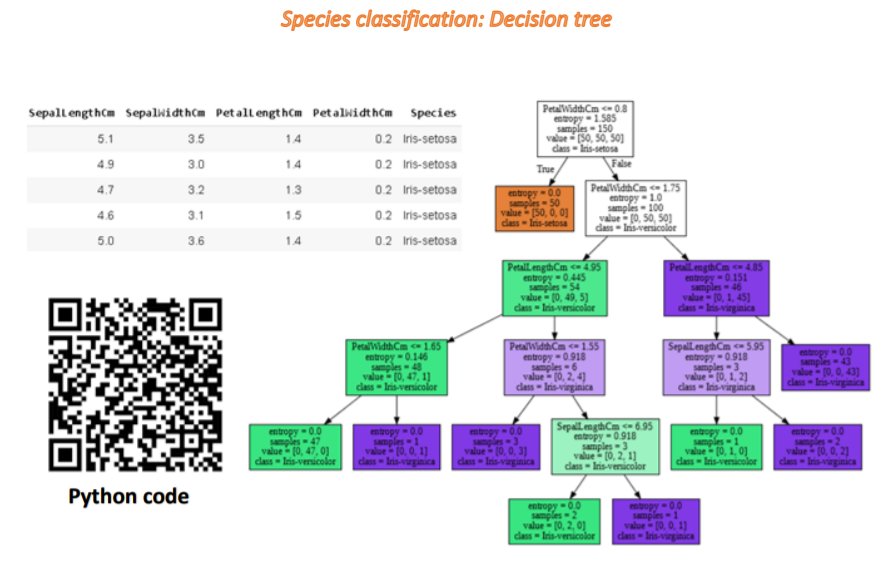
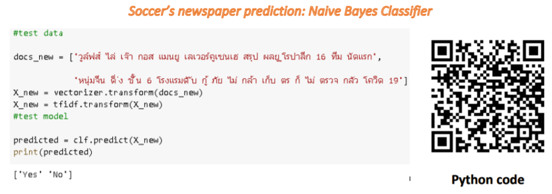
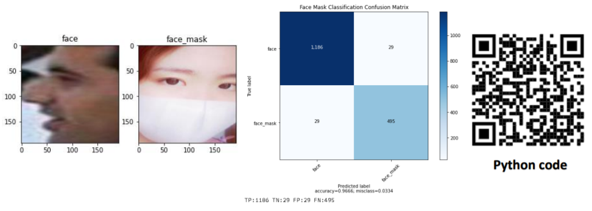
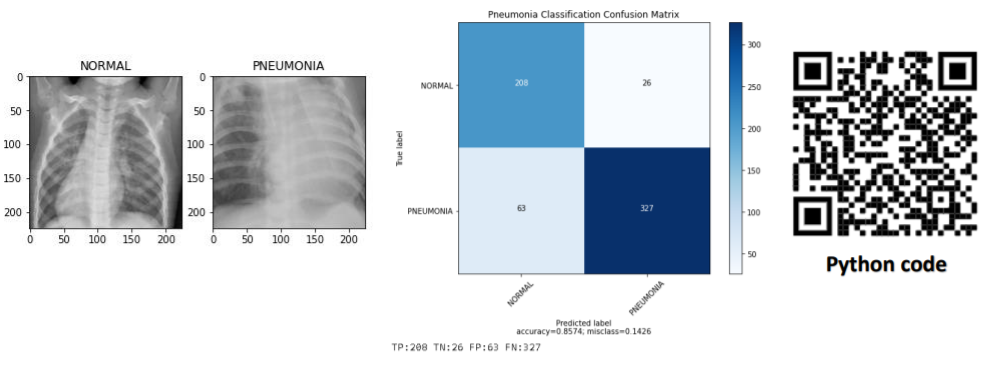
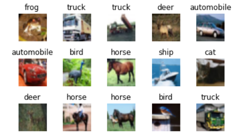

# 2100498 AI-for-Engineer, Chulalongkorn University, 2019

## Optimization
### 1. Hill Climb (find the minimum h in n-Queen problem)

### 2. Genetic algorithm

  
## Machine Learning
### 1. K-mean clustering

### 2. H-clustering

### 3. Linear regression

### 4. Logistic regression

### 5. Decision tree

### 6. Naïve Bayes classifier

  
## Deep learning
### 1. Face mask classification using pretained model (resnet18)

### 2. Pneumonia classification using my own CNN network

### 3. MNIST and CIFAR10 classification using my own neuron network

